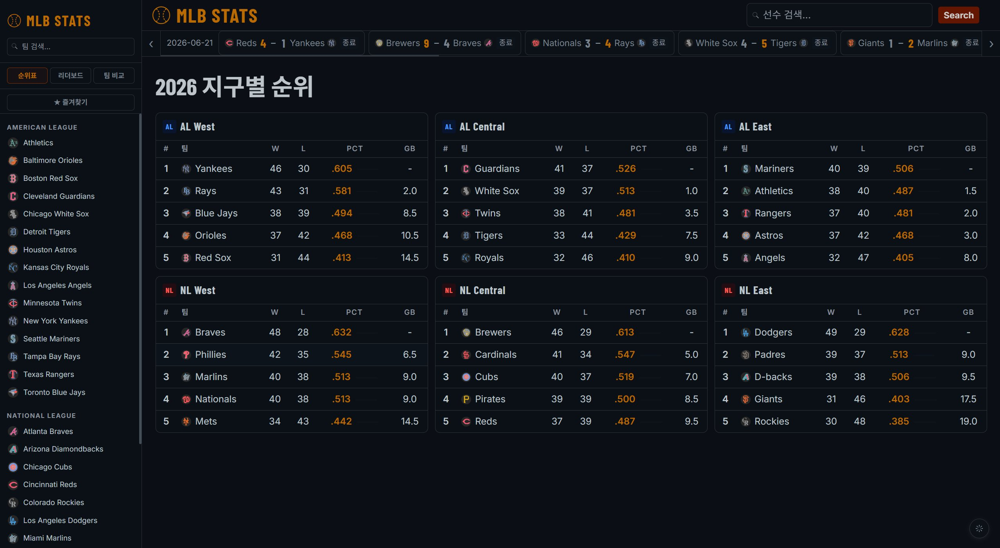
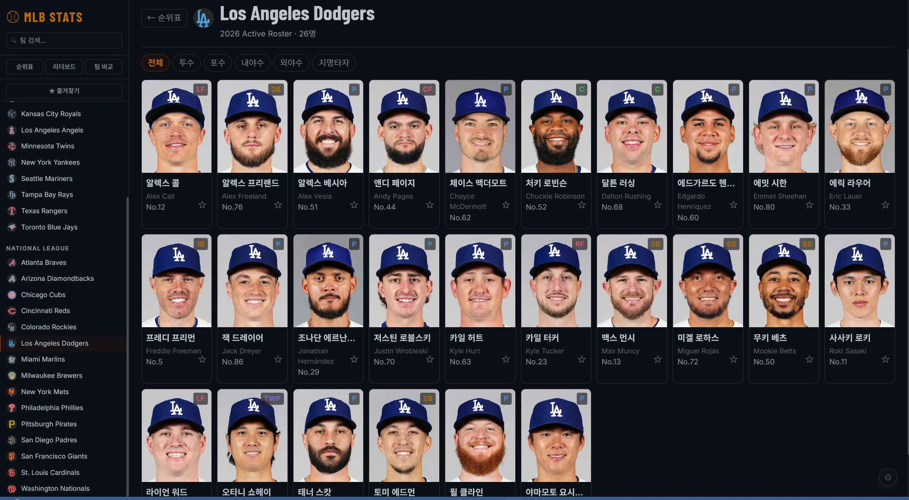
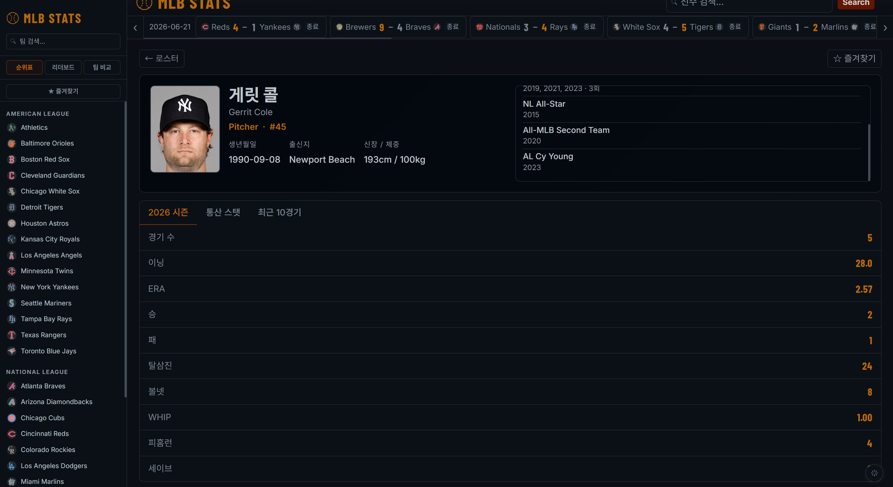

# MLB STATS

> MLB 실시간 통계 조회 웹 애플리케이션


---

## 주요 기능

### 팀 & 순위
- 2026 시즌 MLB 30개 팀 AL/NL 사이드바 목록
- 지구별 순위표 (승/패/승률/게임차 표시)


### 선수 정보
- 팀 로스터 한 줄 8명 그리드 조회 (활성 로스터 기준, 부상자 IL 배지 표시)
- 선수 상세 프로필 — 좌측: 사진 + 기본 정보 / 우측: 수상 경력
- 수상 경력 자동 로딩 (MVP, Cy Young, Gold Glove, Silver Slugger, All-Star 등 주요 수상만 필터링 + 연도별 그룹핑)
- 신장/체중 한국 단위 자동 변환 (피트→cm, 파운드→kg)
- 포지션별 배지 색상 구분 (투수/포수/내야수/외야수/지명타자)
- 이름 한글 자동 번역 (`deep-translator`)


### 스탯 조회
- 2026 시즌 스탯 / 통산 스탯 / 최근 10경기 탭 전환
- 연도별 추이 선 그래프 (통산 스탯 탭 하단, 항목별 ON/OFF 토글)
  - 타자: 타율·홈런·타점·OPS
  - 투수: ERA·탈삼진·승·WHIP
- 최근 10경기 기록 테이블 + Chart.js 시각화
  - 타자: 안타·홈런·타점 바 차트
  - 투수: 탈삼진 바 + ERA 라인 차트


### 리더보드
- 타격·투구 카테고리별 리그 상위 15인 조회

### 팀 비교
- 두 팀 선택 후 타격·투구 스탯 비교
- 항목별 비율 바로 한눈에 시각 비교

### 경기 배너
- 상단 배너에 최근 완료 경기 스코어 실시간 표시
- 버튼으로 날짜 이동 및 배너 스크롤

### 즐겨찾기
- 선수 카드 별 버튼으로 즐겨찾기 추가/제거
- `localStorage`에 저장 (브라우저 재시작 후에도 유지)

### UI/UX
- 다크 / 라이트 테마 토글 (우측 하단 고정 버튼)
- 한글 / 영문 선수 이름 검색 모두 지원
- 반응형 레이아웃 (모바일 대응)
- 글래스모피즘 디자인 + CSS Variables
- 즐겨찾기 사이드바 전용 버튼 (내비 버튼 하단 분리)

---

## 기술 스택

| 구분 | 사용 기술 |
|------|----------|
| 백엔드 | Python, Flask |
| 프론트엔드 | Vanilla JS, Chart.js 4.4 |
| 데이터 | MLB Stats API |
| 번역 | deep-translator (Google Translate) |
| 성능 | ThreadPoolExecutor 병렬 번역, 메모리 캐시 |

---

## 설치 및 실행

```bash
# 패키지 설치
pip install -r requirements.txt

# 서버 실행
python app.py
```

브라우저에서 접속:
```
http://127.0.0.1:5001
```

---

## 프로젝트 구조

```
mlb_stats/
├── app.py              # Flask 서버 & API 라우트
├── crawler.py          # MLB Stats API 호출 함수
├── templates/
│   └── main.html       # 단일 페이지 UI (SPA)
└── requirements.txt
```

---

## 데이터 출처

- [MLB Stats API](https://github.com/toddrob99/MLB-StatsAPI/wiki/Endpoints)
- 선수 사진: MLB Static CDN
- 팀 로고: MLB Static CDN
